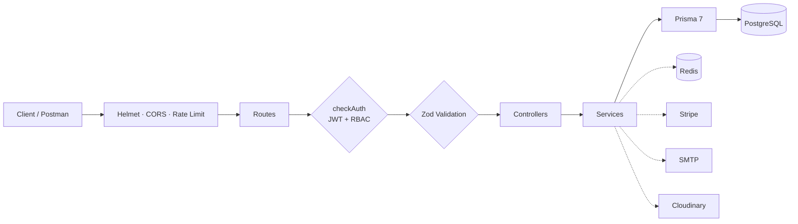

<div align="center">


<br>

# BIDYUT

### Bangladesh Integrated Power Distribution & Utility Tracker

**A production-grade REST API for load-shedding schedules, outage reporting, and restoration tracking — with real Stripe payments, strict role-based access control, grid analytics, and a public status endpoint.**

<br>

[](https://www.typescriptlang.org)
[](https://expressjs.com)
[](https://www.postgresql.org)
[](https://www.prisma.io)
[](https://redis.io)
[](https://stripe.com)
[](https://bidyut-backend.vercel.app)

<br>

**[🚀 Live API](https://bidyut-backend.vercel.app/api/v1)** &nbsp;·&nbsp; **[📮 Postman Collection](#-postman-collection)** &nbsp;·&nbsp; **[🗺️ ERD](./erd.md)** &nbsp;·&nbsp; **[📖 API Flow Guide](./api_flow.md)**

<br>
</div>

<br>

---

## 📌 Overview

In Bangladesh, load-shedding is routine — but information about it isn't. Customers have no unified way to see when their area loses power, report an outage, or get restored faster. Power authorities lack a central system to manage the grid, dispatch technicians, or track resolution times.

---

## ✨ Features

#### 🔐 Auth & Security
- Email/password + Google OAuth 2.0 on one unified account — Google login links to an existing account or auto-creates a new one
- OTP email verification, 6-digit code, 10-minute Redis TTL
- JWT access + refresh tokens in httpOnly, SameSite-aware cookies; Bearer header supported for API clients
- Per-request DB user reload — blocked/deleted accounts denied instantly, even with a valid token
- Staff accounts are never self-service; permission matrix controls who can create whom
- Technician applications: customers apply, admins approve in one transaction
- Rate limiting, Helmet, CORS whitelist

#### 🗺️ Grid & Schedules
- Full CRUD over a four-level grid hierarchy: **Zone → Substation → Feeder → Area**
- Scoped name uniqueness — duplicate names inside the same parent return `409`
- Load-shedding schedules with overlap detection and a weekly per-feeder shed-minute cap
- Schedule status workflow: `SCHEDULED → ONGOING → COMPLETED`

#### 🚨 Outage Lifecycle
- Forward-only state machine: `PENDING → ASSIGNED → IN_PROGRESS → RESOLVED` — illegal transitions return `409`
- Role-scoped visibility: customers see their own reports, technicians their assigned jobs, staff see the full queue
- Bulk incident detection — 5 distinct customers reporting the same area within 15 minutes auto-flags a bulk incident and notifies operators
- Automatic priority for `HEALTHCARE` / `EDUCATION` customers and active SLA subscribers

#### 💳 Payments
- Priority Restoration Pass (৳99, single report) and SLA Subscription (৳499 / 30 days)
- The server always decides the price — clients cannot send an amount
- Stripe signed webhooks with raw-body verification and idempotent replay handling
- All side effects inside a single `prisma.$transaction`; refunds reverse everything atomically
- Branded HTML receipt email with a PDF receipt attached, generated only after the transaction commits

#### 📊 Analytics & Public Data
- Role-specific analytics: operational dashboard, worst-areas heatmap, customer and technician summaries
- Immutable activity log written by every module
- Public grid-status API (no auth required, Redis-cached with `X-Cache: HIT/MISS` header)

---

## 🛠️ Tech Stack

- **Runtime** — Bun · TypeScript (strict mode)
- **Framework** — Express.js 5
- **Database** — PostgreSQL · Prisma 7 (multi-file schema)
- **Cache / OTP** — Redis (fail-open)
- **Auth** — Passport.js (Local + Google OAuth) · JWT
- **Validation** — Zod
- **Payments** — Stripe Checkout + Webhooks
- **Email** — Nodemailer + EJS templates
- **Uploads** — Multer → Cloudinary
- **Deployment** — Vercel · Neon · Redis Cloud

---

## 🏗️ Architecture



<details>
<summary><b>📁 Project Structure</b> (click to expand)</summary>

```
src/
├── server.ts              bootstrap: connect → seed → listen
├── app.ts                 middleware stack, routes, error handler
└── app/
    ├── config/            typed, nested environment access
    ├── lib/               prisma, redis, nodemailer, stripe, passport, cloudinary
    ├── middleware/        checkAuth, validateRequest, rateLimiter, globalErrorHandler
    ├── modules/           auth · user · grid · outage · schedule · payment · analytics · public · internal
    ├── templates/         EJS emails: otp, welcome, receipt, outage-alert, and more
    └── utils/             jwt, pagination, activity, seed, AppError, sendResponse
prisma/
└── schema/                multi-file: enums, user, profiles, grid, outage, schedule, payment, system
```

</details>

---

## 📡 API Reference

- 🔐 **Auth** — `/api/v1/auth` — 12 endpoints
- 👤 **Users** — `/api/v1/users` — 13 endpoints
- 🗺️ **Grid** — `/api/v1/grid/*` — 20 endpoints
- 🚨 **Outages** — `/api/v1/outages` — 7 endpoints
- 📅 **Schedules** — `/api/v1/schedules` — 6 endpoints
- 💳 **Payments** — `/api/v1/payments` — 5 endpoints
- 📊 **Analytics** — `/api/v1/analytics` — 5 endpoints
- 🌐 **Public** — `/api/v1/public` — 1 endpoint
- ⚙️ **Internal** — `/api/v1/internal` — 1 endpoint
- ❤️ **Health** — `/health` — 1 endpoint

**Total: 71 endpoints across 10 modules**

---

## 🚀 Getting Started

**Prerequisites:** [Bun](https://bun.sh) · PostgreSQL · Redis

```bash
git clone https://github.com/<your-username>/bidyut-backend.git
cd bidyut-backend
bun install

cp .env.example .env      # fill DATABASE_URL, REDIS_*, Stripe & SMTP keys

bunx prisma migrate dev   # create tables

bun run dev               # → http://localhost:5000
```

---


## ☁️ Deployment

- **Build** — `tsup` bundles to `dist/` → served via `api/index.ts`
- **Database** — Neon pooled connection · `prisma migrate deploy` on first deploy

---

<div align="center">

<br>

**Built with ⚡ TypeScript, Express 5 & Prisma 7**

<br>

</div>